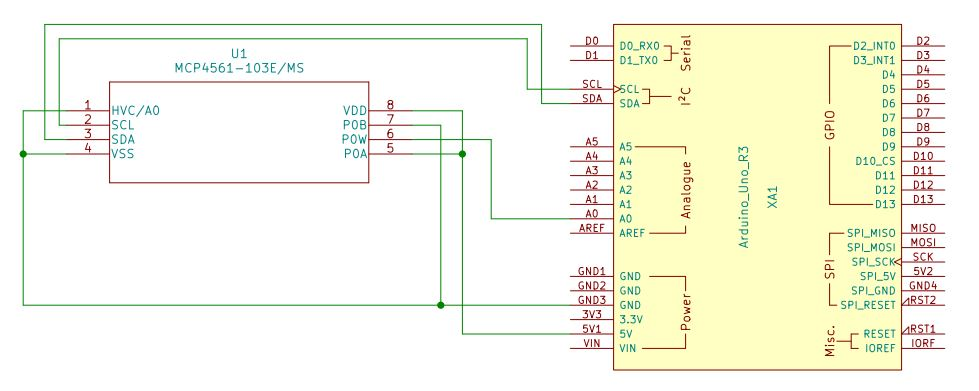

# Microchip MCP4561 Digital Potentiometer Library

This is an Arduino library to be used to control the Microchip MCP4561 Digital Potentiometer.

By Steve Quinn

## Test Circuit

The test circuit above should be used in conjuction with the example sketch 'MCP4561_GenericPotCommands.ino' and an Arduino Uno R3

## Have a question?

Please email your questions here : <demomonkey@gmail.com>

## Download

Download the latest version (version 1) here :

https://github.com/SteveQuinn1/MCP4561_DIGI_POT
